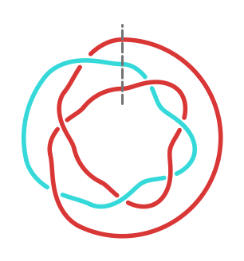
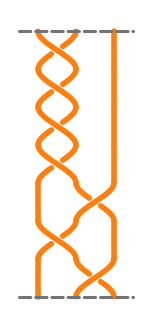

# make_braid

Draw **open** or **closed** braid diagrams from a braid word, export them as
**SVG** (or PDF/PNG), get the **LaTeX** for the braid word, and optionally
identify the **topology of the closure** with SageMath/KnotInfo.

Everything is one self-contained script: [`make_braid.py`](make_braid.py).

| closed (annular) | open (rectangular) |
| :--------------: | :----------------: |
|  |  |

Both show the same braid `σ₁⁴σ₂⁻¹σ₁σ₂⁻¹` on 3 strands, with `--mark-ends`
(dashed lines marking where the word starts/ends). The closed diagram colours
each link component of the closure; the open one is drawn in a single colour
(`--color-mode single --fg-color tab:orange`).

---

## Requirements

### Required

- **Python 3.8+**
- **matplotlib** — all drawing and export
- **tkinter** — only for the GUI (ships with most Python installs; on some
  Linux distros it is a separate package such as `python3-tk`)

```bash
pip install matplotlib
```

Drawing, SVG/PDF/PNG export, the GUI, and the LaTeX output all work with a
plain Python install. **SageMath is not needed for any of that.**

### Optional: SageMath

[SageMath](https://www.sagemath.org/) is used **only** for the topology
features:

- `--info` — link invariants of the closure (e.g. Jones polynomial)
- **KnotInfo identification** of the closure — the `Identify (KnotInfo)`
  button in the GUI, and the `KnotInfo` line of `--info`

KnotInfo lookup additionally needs Sage's optional database:

```bash
sage -i database_knotinfo
```

There are two supported ways to get the Sage features:

1. **Run the script under Sage** (in-process):
   ```bash
   sage make_braid.py "1 1 1 1 -2 1 -2" -n 3 --info
   ```
2. **Run the GUI under your system Python** and let it call Sage for you.
   When Sage is not importable, the script automatically shells out to the
   `sage` executable on your `PATH` for the KnotInfo lookup, so the
   `Identify (KnotInfo)` button keeps working. (The lookup runs on a
   background thread; the first call is slow because Sage has to start up.)

> [!IMPORTANT]
> **Do not launch the GUI with `sage -python` on macOS.** Sage's bundled
> Python cannot initialise Tcl/Tk and fails with
> `ImportError: Failed to load Tcl_SetVar`. Use your system Python
> (`python3 make_braid.py`) — the KnotInfo button still reaches Sage via the
> subprocess fallback described above.

`Link.get_knotinfo()` raises when the closure is not in the KnotInfo database
or cannot be uniquely identified (e.g. knots with more than 13 crossings).
The script catches this and reports it instead of crashing:

```
not found in KnotInfo (NotImplementedError: this knot having more than 13 crossings cannot be determined)
```

---

## Braid words

A braid is given by its word in **Artin generators (Tietze notation)**: a list
of non-zero integers where `i` means σ_i (strand *i* crosses **over** strand
*i+1*) and `-i` means σ_i⁻¹. Strands are 1-indexed, so `1 1 -2 1 -2` needs at
least 3 strands.

Accepted input forms are equivalent:

```
"1 1 -2 1 -2"     "1,1,-2,1,-2"     "[1, 1, -2, 1, -2]"
```

If `-n/--strands` is omitted it is inferred as `max(|g|) + 1`.

---

## GUI

```bash
python3 make_braid.py            # or: python3 make_braid.py --gui
```

Running with **no braid word** opens the GUI: a live preview on the left and
two columns of parameters on the right. It includes:

- every drawing parameter, applied on **Enter** or when you click away
- a **LaTeX** box showing the braid word (open form and closure), with a
  **Copy LaTeX** button
- an **Identify (KnotInfo)** button for the closure's topology

---

## Command line

```bash
# Closed braid (the default) -> closed.svg
python3 make_braid.py "1 1 -2 1 -2" -n 3 -o closed.svg

# Open braid running left-to-right, with dashed start/end markers
python3 make_braid.py "1 -2 1 -2" --open --flow left-right --mark-ends

# Closed braid with the seam at 3 o'clock, counter-clockwise winding
python3 make_braid.py "1 1 1" -n 2 --start-angle 0 --winding ccw --mark-ends

# A single colour instead of per-component colours
python3 make_braid.py "1 1 -2 1 -2" -n 3 --color-mode single --fg-color "#1f77b4"

# Transparent background, PDF output
python3 make_braid.py "1 1 -2 1 -2" -n 3 --transparent -o braid.pdf

# LaTeX for the braid word (open form + closure)
python3 make_braid.py "1 1 -2 1 -2" --latex

# Invariants + KnotInfo topology of the closure (needs Sage)
sage make_braid.py "1 1 1 1 -2 1 -2" -n 3 --info
```

The output format is taken from the `-o` extension (`.svg`, `.pdf`, `.png`, …).

### Options

| Option | Meaning | Default |
| --- | --- | --- |
| `word` | Braid word, Tietze notation. Omit to open the GUI. | – |
| `-n`, `--strands` | Number of strands | inferred |
| `-o`, `--output` | Output file (extension picks format) | `braid.svg` |
| `--closed` / `--open` | Annular closure vs. rectangular braid | `--closed` |
| `--flow` | `top-down`, `bottom-up`, `left-right`, `right-left` | `top-down` |
| `--start-angle` | Closed: seam angle in degrees (0 = right, 90 = top) | from `--flow` |
| `--winding` | Closed: `auto`, `cw`, `ccw` | `auto` |
| `--mark-ends` | Dashed start/end markers (seam for closed, edges for open) | off |
| `--color-mode` | `auto`, `component`, `strand`, `single` | `auto` |
| `--thickness` | Line width | `4.0` |
| `--gap` | Under-strand break size (fraction of a cell) | `0.1` |
| `--samples` | Samples per crossing arc (smoothness) | `40` |
| `--r0`, `--dr` | Closed: inner radius, radial step between strands | `0.5`, `0.25` |
| `--spacing`, `--level-height` | Open: strand spacing, height of one crossing | `1.0`, `1.0` |
| `--figsize`, `--margin` | Canvas size and margin | `6.0`, `0.08` |
| `--transparent` | Transparent background | off |
| `--bg-color`, `--fg-color` | Background colour; single-mode strand colour | `white`, `black` |
| `--latex` | Print the braid word's LaTeX, don't draw | off |
| `--info` | Closure invariants + KnotInfo topology (needs Sage) | off |
| `--gui` | Force the GUI | off |

Colours accept any matplotlib spec: hex (`#1f77b4`, `#f00`), names (`red`,
`rebeccapurple`), grayscale strings (`0.5`), `tab:orange`, `C0`–`C9`,
`xkcd:sky blue`. `--fg-color` only applies when `--color-mode=single`.

---

## Direction and the start/end seam

`--flow` sets the direction for **both** diagram styles:

- **Open** — which way the word runs across the page. `top-down` reads the
  first letter at the top; `left-right` reads it at the left.
- **Closed** — the winding sense and the default angle of the start/end
  **seam** (where the word wraps around). `top-down` → seam at 12 o'clock,
  clockwise; `left-right` → seam at 9 o'clock; and so on.

Override the closed seam independently with `--start-angle` and `--winding`.
`--mark-ends` draws the seam (closed) or the start/end edges (open) as dashed
grey lines.

---

## LaTeX output

`--latex` prints the braid word, combining consecutive equal generators into
powers:

```console
$ python3 make_braid.py "1 1 1 -2 -2 1" --latex
% open braid word
\sigma_{1}^{3}\sigma_{2}^{-2}\sigma_{1}
% closed braid (closure)
\widehat{\sigma_{1}^{3}\sigma_{2}^{-2}\sigma_{1}}
```

The same two lines appear live in the GUI's LaTeX box.

> Note: `\widehat` stops widening after a few characters, so over a long word
> the hat will not span the whole expression. For write-ups, name the braid
> once and hat the symbol — `\beta = \sigma_{1}^{3}\dots` then `\widehat{\beta}`
> — or use `\overline{...}`, which stretches to any width.

---

## Topology of the closure

```console
$ sage make_braid.py "1 1 1 1 -2 1 -2" -n 3 --info
[info] strands           : 3
[info] word              : [1, 1, 1, 1, -2, 1, -2]
[info] closure components: 2
[info] Jones polynomial  : t^(13/2) - 2*t^(11/2) + 2*t^(9/2) - 3*t^(7/2) + ...
[info] KnotInfo          : (<KnotInfo.L7a6_0: 'L7a6{0}'>, <SymmetryMutant.itself: 's'>)
```

So the closure of that braid is the link **L7a6{0}**. The component count is
computed in pure Python and is always available; the Jones polynomial and the
KnotInfo identification need Sage.

---

## License

[MIT](LICENSE)
